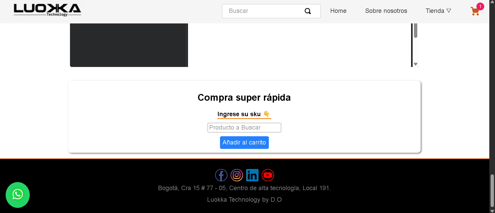

# ⚡ Componente Quick Order (Compra Rápida)


* [🚀 Visión General](#-visión-general)
* [🖼️ Previsualización del Componente](#-previsualización-del-componente)
* [🏗️ Instalación y Ejemplo de Uso](#-instalacion-y-ejemplo-de-uso)
    * [1. Dependencia](#1-dependencia)
    * [2. Declaración en Blocks](#2-declaración-en-blocks)
* [📜 Operaciones GraphQL](#-operaciones-graphql)
* [⚙️ Funcionamiento y Flujo de Compra](#-funcionamiento-y-flujo-de-compra)
* [🎨 Personalización con CSS Handles](#-personalización-con-css-handles)
* [🪪 Contribución y Licencia](#-contribución-y-licencia)


## 🚀 `Visión General`

Este componente fue creado con el template de `react-app-template` y fue diseñado para implementar una funcionalidad de Compra Rápida `(Quick Order)` en la tienda. Su propósito principal es permitir a los usuarios con conocimiento previo del producto (generalmente clientes B2B) agregar un artículo al carrito y proceder directamente al checkout con solo ingresar el ID de SKU del producto.

### Flujo de Datos

El componente opera en tres pasos fundamentales:

1. El usuario ingresa un SKU y presiona **"Buscar/Comprar"**.

2. Se realiza una consulta GraphQL para obtener el `productId` asociado a ese SKU.

3. Si el producto es encontrado, se ejecuta una mutación GraphQL para **agregar el producto al carrito** y, de inmediato, redirigir al usuario a `/checkout`.


## 🖼️ `Previsualización del Componente`




## 🏗️ `Instalación y Ejemplo de Uso`

El componente no requiere propiedades `(props)` externas, ya que su funcionalidad se basa en la interacción del usuario y consultas internas de GraphQL.

### 1. Dependencia

Asegúrate de que las siguientes aplicaciones estén declaradas en las dependencias de tu `manifest.json`, ya que son necesarias para las operaciones de búsqueda y carrito:

```json
// En manifest.json de tu tienda
"dependencies": {
  "{vendor}.quick-order": "0.x"
}

// Verifica en manifest.json del componente Quick Order 
"dependencies": {
  "vtex.checkout-graphql": "0.x",
  "vtex.search-graphql": "0.x",
  "vtex.css-handles": "0.x"
}
```

* `vtex.checkout-graphql` (Necesaria para la mutación addToCart).

* `vtex.search-graphql` (Necesaria para la consulta del producto por SKU).

* `vtex.css-handles` (Necesaria para la personalización de estilos).

### 2. Declaración en Blocks

El componente se declara como un bloque simple en cualquier template donde se quiera ofrecer la compra rápida (Ej. `store/blocks.jsonc`):

```json
"quick-order": {
  "title": "Quick Order",
  "props": {
    // No requiere props de configuración
  }
}
```

## 📜 `Operaciones GraphQL`
El componente utiliza dos operaciones principales de GraphQL: una para consultar datos del producto y otra para modificar el carrito.

1. Consulta del Producto `(getProductBySku.graphql)`
Se utiliza un useLazyQuery para obtener el productId (que es el itemId real para el carrito) a partir del SKU ingresado por el usuario:

```graphql
query ($sku: ID!) {
  product(identifier:{field: sku, value: $sku}) {
    productId,
    productName
  }
}
```

2. Mutación al Carrito `(updateCart.graphql)`
Se utiliza un useMutation para agregar el productId al carrito.

```graphql
mutation UPDATE_CART($items: [ItemInput], $salesChannel: String) {
  addToCart(items: $items, salesChannel: $salesChannel) {
    id
  }
}
```

## ⚙️ `Funcionamiento y Flujo de Compra`

* **Búsqueda (`useLazyQuery`):** Al enviar el formulario, se activa la búsqueda asíncrona (`getProductData`) con el SKU.

* **Validación y Mutación (`useEffect`):** Un `useEffect` monitorea el resultado de la búsqueda:
  * Si se encuentra el producto, llama a la función `updateAddToCart`.
  * Si no se encuentra, muestra el mensaje de error: `"No existe el producto, ingresado." o "Ingrese un sku primero".`

* **Adición y Redirección:** La función `updateAddToCart` realiza la mutación para añadir **una (1) unidad** del producto al carrito (`quantity: 1, seller: "1", salesChannel: "1"`). Tras el éxito de la mutación, el usuario es redirigido inmediatamente a `/checkout`.


## 🎨 `Personalización con CSS Handles`
Puedes personalizar la apariencia de los elementos usando las siguientes clases (CSS Handles):

| Handle | Elemento | Descripción |
| :--- | :---| :--- |
| **`container__quick-order`** | `<div>` | Contenedor principal que envuelve todo el componente. |
| **`title__quick-order`** | `<h2>` | Título predeterminado del componente: **"Compra super rápida"**. |
| **`form__quick-order`** | `<form>` | El formulario que contiene la entrada y el botón. |
| **`label__quick-order`** | `<label>` | La etiqueta del campo de entrada ("Ingrese su sku 👇"). |
| **`button__quick-order`** | `<button>` | EL botón de acción para enviar la solicitud. |
| **`notFound__quick-order`** | `<div>` | Mensaje de error cuando el SKU no es encontrado o el campo está vacío. |


## 🪪 `Contribución y Licencia`

### 🤝 Contribución 

Si deseas contribuir con mejoras, reportar *bugs* o sugerir nuevas características:

1.  Haz un *fork* del repositorio.
2.  Crea una nueva rama (`git checkout -b feature/nueva-funcionalidad`).
3.  Realiza tus cambios y haz *commit* (`git commit -m 'feat: Añadir nueva funcionalidad'`).
4.  Sube la rama (`git push origin feature/nueva-funcionalidad`).
5.  Abre un *Pull Request*.

###  📜 Licencia

Este proyecto está bajo la **Licencia MIT**.

> **[](https://opensource.org/licenses/MIT)**

> **[](https://github.com/vtex-apps/whatsapp-button/blob/main/LICENSE)**